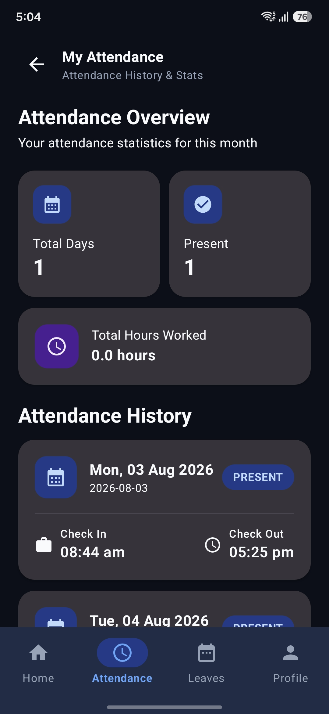

# Employee Attendance System

A full-stack **Employee Attendance & Leave Management System** with separate workflows for **Employees** and **HR Managers**.

The application consists of an **Android frontend built with Kotlin and Jetpack Compose**, a **Spring Boot backend**, and a **MySQL database**.

---

# 🌐 Live Deployment

The application uses the following deployment setup:

| Component | Technology / Service |
|---|---|
| **Frontend** | Android App — Kotlin + Jetpack Compose |
| **Backend** | Spring Boot — Render |
| **Database** | MySQL — Aiven |
| **Source Code** | GitHub |

### 📥 Download Android App

<a href="apk/apk/Employee%20Attendance%20System.apk" download>
   ⭐Employee Attendance APK⭐
</a>

---

# ⚠️ Important: Free Deployment Notice

> **Please read before testing the live application.**

This project is currently deployed using **free-tier hosting services**.

Because the backend is deployed on a free Render instance:

- The application may sometimes feel **slow**.
- The **first login/request may take some time**.
- The Render backend can **sleep after a period of inactivity**.
- When the backend is sleeping, the first request needs to wake the server.
- Because of this, the login request may take longer than usual when the application has not been used recently.
- Once the backend is awake, subsequent requests should normally respond faster.

**If login appears to take some time on the first attempt, please wait rather than immediately closing the application. This delay is expected because of the free-tier backend deployment.**

---

# 🔐 Demo Credentials

Use the following accounts to test the application.

## 🧑‍💼 HR Account

```text
Email:    hr@demo.com
Password: demo123
```
## 👨‍💻 Employee Account

```text
Email:    employee@demo.com
Password: demo123
```


> **Note:** These accounts are demo accounts intended for recruiters, reviewers, and testers.

---

# 📌 Project Overview

The Employee Attendance System digitizes common employee attendance and HR management workflows.

## 👨‍💻 Employee Portal

Employees can:

- Login securely
- Check in and check out
- View attendance records
- Track working hours
- View leave balance
- Apply for leave
- Track leave request status
- View their profile

## 🧑‍💼 HR Portal

HR users can:

- View dashboard statistics
- Manage employees
- Search employee records
- Add employees
- Edit employee information
- Delete employees
- Monitor employee attendance
- Search attendance records
- Review leave requests
- Approve or reject leave requests
- View reports and analytics

---

# ✨ Features

## Employee Features

- JWT-based login
- Role-based access
- Daily attendance
- Check-in/check-out
- Attendance history
- Working-hours tracking
- Leave balance
- Leave application
- Leave request history
- Employee profile

## HR Features

- HR dashboard
- Employee statistics
- Employee management
- Employee search
- Attendance monitoring
- Attendance search
- Leave request management
- Leave approval/rejection
- Reports & analytics
- Date-range based reporting

---

# 🛠️ Tech Stack

## 📱 Android Frontend

- **Kotlin**
- **Jetpack Compose**
- **Material 3**
- **Retrofit**
- **OkHttp**
- **Gson**
- **Kotlin Coroutines**
- **Android SDK**

## ☕ Backend

- **Java**
- **Spring Boot**
- **Spring Security**
- **JWT Authentication**
- **BCrypt**
- **REST APIs**
- **Spring Data JPA**
- **Hibernate**
- **Maven**

## 🗄️ Database

- **MySQL**
- **Aiven MySQL**

## ☁️ Deployment

- **Render** — Spring Boot backend
- **Aiven** — MySQL database
- **GitHub** — Source code and version control

---


# 🔐 Security

The backend implements authentication and authorization using **Spring Security and JWT**.

Security features include:

- JWT authentication
- Role-based access control
- Stateless authentication
- BCrypt password hashing
- Protected REST APIs
- Employee-specific authorization
- HR-only protected endpoints
- CORS configuration

---


# 📸 Screenshots

<p align="center">
  
  
  
</p>
<p align="center">
  
  
  
</p>
<p align="center">
  
  
</p>

---

# 🚀 Future Improvements

Possible future improvements include:

- Push notifications
- Email notifications for leave approvals
- Forgot-password functionality
- Password reset
- Admin role
- Pagination for large employee datasets
- Advanced attendance analytics
- Excel report export
- Audit logs
- Automated testing
- CI/CD pipeline
- Production monitoring

---

# 👨‍💻 Project

**Employee Attendance System**

A full-stack employee attendance and leave management application built using:

**Kotlin + Jetpack Compose + Spring Boot + Spring Security + JWT + MySQL**

